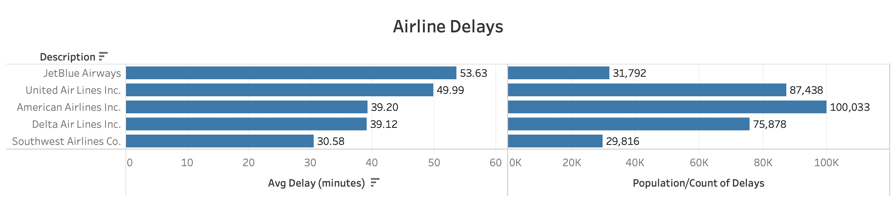

Investigating Linear Regression in Python using airport delay data

For my first solo project at Metis I was able to choose what I would like to investigate and build a linear regression model. The larger goal of the project, in my opinion, was to build mental circuitry and connect the dots on all the new skills we have learned.

For my 2nd project at Metis, I thought it would be less challenging if I experimented with airport data. With the airport data I could build a liner regression model that predicts the airport delays, in minutes, based on Airline, Month, Day of the Week, Distance Traveled, and Origin/Destination Aiport.


-----

### Objectives

Applying the skills learned in the program so far to investigate linear regression with data.
* Data Aquistion - Via Web Scraping or downloading the data. In my case I downloaded semi-structured CSV files.
* Using Numpy and Pandas to conduct exploratory analysis
* Playing around with Python libraries like statsmodels, scikit-learn, matplotlib, and seaborn
* Also an objective is to be creative and exercise my Python muscles 

## Methodology

The airport data is available in the [Bureau Of Transpostation .gov site](hhttps://www.transtats.bts.gov/DL_SelectFields.asp?Table_ID=236) and updated monthly. The data is not "clean" and does need standardization (see list below).

* Join different tables that provide description or name data for airline codes, aiport IDs, and Day of The Week. E.g. UA is United Airlines and Day of The Week=1 is the same as Monday.
* removing NULLs or sometimes known as NAN
* formatting fields and removing unecessary spacing
* creating dummy variables to measure the categorical data for linear regression
* also data visualization in Tableau

Once the data is cleaned then we can start exploring Linear Regression.

## Python
Happy with this script that itirates through the standarized named data so we can load it.
```
from datetime import timedelta, date

def daterange(start_date, end_date):
    for n in range(int ((end_date - start_date).days)):
        yield start_date + timedelta(n)

start_date = date(2018, 1, 1)
end_date = date(2019, 12, 20)
my_list=[]
for single_date in daterange(start_date, end_date):
    my_list.append(single_date.strftime("%Y-%m"))
    unique_list = [
        e
    for i, e in enumerate(my_list)
    if my_list.index(e) == i
]
unique_list
    
    #print(single_date.strftime("%Y-%m-%d"))
print(unique_list)
```


When analyzing the data I looked at delay time versus each individual categorization. E.g. Delay Time vs Day of Week and seperately Delay Time vs Airline.
Also looked into Delay Time collinearity with all the variables together. 

The best approach, for myself, was to analyze the catagorical variables against the target delay time. Also this approach allowed for the matrices to be more digestible.

Example image below of analyzing few variables.


In comparison analayzing many variables like the image below.


However I wanted to create this model with more variables, because intuitively it seems like an impact to delay time can be caused by many factors.

The values for r squared and mean absolute error made sense with the data. 


The delay times for my subset of data analyzed had average times of betwen 30 minutes to an hour.





## Recommendations

Further exploration of predictive models to better improve our delay time predictions. 


====